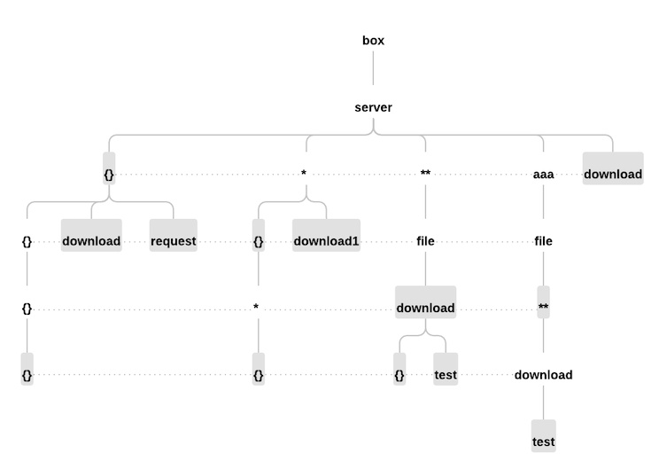

# LayeredRequestMappingHandlerMapping

### 1. 概述

`LayeredRequestMappingHandlerMapping` 是 `RequestMappingHandlerMapping` 的子类，旨在通过分层路径匹配机制提高请求映射查找效率，同时保留其原始功能。

### 2. 背景和目的

在当前项目中，`RequestMappingHandlerMapping` 中常用的变量风格 API 通过迭代所有注册的映射并选择最佳匹配来匹配请求路径。随着映射数量的增加，这种线性搜索方法会导致性能逐渐下降。

`LayeredRequestMappingHandlerMapping` 通过使用 '/' 符号将路径拆分成多个层并利用分层结构来优化查找过程。这种分层方法在匹配过程中显著减少了搜索范围，从而提高了效率。

### 3. 设计方案

传统的路径风格 API 可以使用 `HashMap` 进行高效查找，其性能足够。然而，变量风格 API 不同，因为其路径包含动态变量，无法使用 `HashMap` 定位。本设计主要关注优化和改进变量风格 API 匹配的性能。RESTful API 目前是主流接口方法，并被广泛使用。

**注意**：如果 URI 映射包含 `?`，`LayeredRequestMappingHandlerMapping` 将不支持它，并将请求委托给父类进行处理。

- **核心概念**

  - **分层路径**：请求路径基于 `/` 分隔符拆分成多个分层级别，每个级别与上下级别相连。映射路径被分成多个级别，每个级别称为 **LayerPath**。例如，路径 `/user/{id}/profile` 被分解成三个层：`user`、`{id}` 和 `profile`。
  - **路径树**：一个分层数据结构，用于存储和管理分层路径。
  - **匹配层**：不同的匹配策略，如静态路径匹配、变量匹配和通配符匹配。在匹配请求路径时，过程逐层进行。每个级别可以是静态路径、变量路径或通配符路径。这种分层匹配机制使路径匹配更加灵活和高效。

  **主要类和方法**

  - `LayeredRequestMappingHandlerMapping`：主类，扩展 `RequestMappingHandlerMapping`，负责注册和定位请求映射。
  - `PatternLayerRegistry`：路径树的注册器，负责构建和管理路径树。
  - `PatternLayer`：路径树中的节点，包含路径信息、映射细节和子节点。
  - `LayerPath`：表示路径的分层结构，支持路径拆分和连接。
  - `MatchLayer`：匹配层的接口，定义各种匹配策略。
  - `LayerPathMatch`、`LayerVariableMatcher`、`LayerWildcardMatcher`、`LayerWildcard2Matcher`：匹配层的具体实现。

  **查找和匹配**

  - **查找**：在 `lookupHandlerMethod` 方法中，将请求路径和方法组合成分层路径，然后在路径树中搜索。如果找到匹配的 `PatternLayer`，则进行进一步验证。
  - **匹配**：在每个层遍历期间，使用不同的匹配器（`LayerPathMatcher`、`LayerVariableMatcher`、`LayerWildcardMatcher`、`LayerWildcard2Matcher`）进行匹配。匹配结果存储在请求属性中以供后续处理。

  **优化和性能**

  - **分层存储**：通过分层方式存储路径，减少了查找次数，提高了搜索效率。
  - **匹配策略**：不同的匹配层支持各种策略，如静态路径匹配、变量匹配和通配符匹配，确保灵活性和准确性。
  - **缓存和重用**：匹配结果被缓存，并尽可能早地终止深度遍历，进一步提高性能。

  **可靠性**

  - **兼容性**：由于它扩展了 `RequestMappingHandlerMapping`，它保持了与现有功能的兼容性。如果未找到匹配，则最终将请求交给父类进行处理。

#### 3.1. 路径树



上图展示了通过根据 `/` 分隔符将项目中的所有映射拆分成多个层来构建路径树的过程。例如，使用映射 `/box/server/{}/download` 和 `/box/server/download`，构建路径树的过程如下：

- 两个映射的前两个段相同（`/box/server`），因此只有一个名为 `box` 的顶级节点，其下是 `server`。
- 第三个段是 `{}` 和 `download`，因此在 `server` 下，有两个分支：`{}` 和 `download`。
- 第一个映射的第四个段是 `download`，因此在 `{}` 分支下，有一个 `download` 节点。然而，第二个映射以 `download` 结束，没有第四个段，使 `download` 成为叶节点。
- 项目中的所有映射都以这种方式处理，最终构建一个路径树。

#### 3.2. 路径查找

将映射转换为路径树的主要目的是利用其分层结构来缩小搜索范围，避免迭代所有映射进行匹配。当发出请求时，请求路径根据 `/` 分隔符拆分成多个层。第一层与路径树的根节点匹配。如果成功，则下一层继续与子节点匹配，依此类推。如果当前层节点包含不确定节点如 `{}`、` *` 或 `**`，则搜索进入这些节点以找到最佳匹配。如果在此分支中找到匹配，则尽早退出搜索以避免性能影响。这个过程重复进行，直到到达路径的最后一层，如果相应节点是叶节点，则返回关联的映射。整个过程在匹配过程中显著减少了搜索范围，从而提高了效率。

**RequestPath 分层并在路径树中搜索的代码：**

Code

```
/**
 * First, convert the request path into LayerPath,
 * Then perform a depth search on the path-tree to find the best PatternLayer.
 * The best PatternLayer found will be stored in request.attribute[MATCHES_ATTRIBUTE].
 * @see #MATCHES_ATTRIBUTE
 * @param requestPath mapping lookup path within the current servlet mapping
 * @param request the current request
 * @return the patternLayer found in the search.
 */
public @Nullable PatternLayer lookupPattern(String requestPath, HttpServletRequest request) {
   LayerPath lookupPath = LayerPath.create(requestPath);
   LayerPath lp = lookupPath;
   PatternLayer layer = null;
   Map<LayerPath, PatternLayer> layers = this.patternLayers;
   for (; lp != null; lp = lp.next(), layers = (layer != null ? layer.subLayers : null)) {
      if (layers == null || (layer = matching(layers, lp, request)) == null) {
         return null;
      }
      if (getFoundMatches(request) != null || lp.isLeaf()) {
         return layer.mapping != null ? layer : layer.subLayers.get(lp.wildcard2());
      }
   }
   return layer;
}
```

**逐层匹配**：

- 使用 `for` 循环遍历每个 `LayerPath` 层，直到 `lp` 变为 `null`。
- 在路径树的当前层中，通过调用 `matching` 方法搜索匹配的 `PatternLayer`。
- 如果找到匹配的 `PatternLayer`，则更新 `layer` 和 `layers`，并继续到下一层。
- 如果 `lp` 是叶节点（即 `lp.isLeaf()` 返回 `true`）或已经找到了 `LayeredMatch`，则返回当前的 `layer`。

**在路径树节点中匹配 RequestPath 的一层的代码：**

Code

```
/**
 * From a certain layer of the path-tree, find the PatternLayer that matches the request path.
 * Use four types of matchers for matching, and the matching order is: path > {} > * > **
 * This process is a deep recursion
 * @param patternLayers the path-tree
 * @param path a segment in the request path
 * @param request the current request
 * @return the patternLayer found in the search
 */
private @Nullable PatternLayer matching(Map<LayerPath, PatternLayer> patternLayers, LayerPath path, HttpServletRequest request) {
   if (patternLayers.size() == 0) {
      return null;
   }
   PatternLayer patternLayer;
   for (LayerMatcher m : this.matches) {
      if ((patternLayer = m.match(patternLayers, path, request)) != null) {
         return patternLayer;
      }
   }
   return null;
}
```

**路径匹配：**

- `matches` 是多个 `LayerMatcher` 对象的集合，按照 `path > {} > * > **` 的顺序排列。匹配器的顺序决定了匹配优先级，其中 `path` 匹配器优先级最高，`**` 匹配器优先级最低。
- 迭代每个匹配器 `m`，并调用其 `match` 方法尝试匹配当前路径段 `path`。
- 如果匹配器返回非 `null` 的 `PatternLayer`，则立即返回它。

**匹配器的实现**

1. **路径匹配 (`LayerPathMatcher`)**：

   Code

   ```
   /**
    * A pure path style matching tool
    */
   class LayerPathMatcher implements LayerMatcher {
   
     /**
      * Search for a PatternLayer in the current path-tree layer that matches request path.
      * If the current layer has uncertain factors, continue exploring downward (repeating the matching process);
      * otherwise, return directly.
      * @param patternLookup the path-tree
      * @param path a segment in the request path
      * @param request the current request
      * @return the patternLayer found in the search
      */
     @Override
     public @Nullable PatternLayer match(Map<LayerPath, PatternLayer> patternLookup, LayerPath path, HttpServletRequest request) {
       PatternLayer patternLayer = lookup(patternLookup, path);
       if (patternLayer != null) {
         if (patternLayer.uncertain) {
           PatternLayer finalPatternLayer = explore(path, patternLayer, request);
           if (finalPatternLayer == null) {
             return null;
           }
           if (finalPatternLayer.mapping != null && getFoundMatches(request) != null) {
             return finalPatternLayer;
           }
         }
         else if (path.isLeaf()) {
           if (patternLayer.mapping == null) {
             return null;
           }
           return matchingCondition(patternLayer, request);
         }
       }
       return patternLayer;
     }
   
     /**
      * Returns the PatternLayer to which the specified path is mapped
      * Find PatternLayer in the path tree by path.
      * @param patternLookup the path-tree
      * @param path a segment in the request path.
      * @return the PatternLayer to which the specified path is mapped
      */
     public @Nullable PatternLayer lookup(Map<LayerPath, PatternLayer> patternLookup, LayerPath path) {
       return patternLookup.get(path);
     }
   
     /**
      * Continuously explore downward in the path tree until a PatternLayer matching the path is found;
      * otherwise, return null. If a matching PatternLayer is found at the last layer (leaf node),
      * perform the matchingCondition method for validation. If the validation passes,
      * notify the external search that the desired result has been found and can be terminated.
      * @param path a segment in the request path.
      * @param pl the matched node in the path tree.
      * @param request the current request
      * @return
      */
     public @Nullable PatternLayer explore(LayerPath path, PatternLayer pl, HttpServletRequest request) {
       if ((path.isLeaf() && pl.mapping != null)) {
         return matchingCondition(pl, request);
       }
       LayerPath next = path.next;
       PatternLayer patternLayer;
       if ((next != null && pl.subLayers.size() > 0 && (patternLayer = matching(pl.subLayers, next, request)) != null)) {
         return patternLayer;
       }
       else {
         return null;
       }
     }
   }
   ```

   - **查找**：在路径树的当前层中搜索与 `LayerPath` 匹配的 `PatternLayer`。
   - **探索**：如果找到匹配的 `PatternLayer` 并且该层包含不确定因素（如变量或通配符），则继续向下探索，直到找到匹配的叶节点。
   - **验证**：如果找到匹配的叶节点，则调用 `matchingCondition` 方法进行进一步验证。

2. **变量匹配 (`LayerVariableMatcher`)**：

   Code

   ```
   /**
    * A variable path style matching tool
    */
   class LayerVariableMatcher extends LayerPathMatcher {
   
      /**
       * The search method is almost the same as super match, except that the parameter for lookup is '{}'."
       * @param patternLookup the path-tree
       * @param path a segment in the request path
       * @param request the current request
       * @return the patternLayer found in the search
       */
      @Override
      public @Nullable PatternLayer match(Map<LayerPath, PatternLayer> patternLookup, LayerPath path, HttpServletRequest request) {
         PatternLayer patternLayer = lookup(patternLookup, path);
         if (patternLayer != null) {
            PatternLayer finalPatternLayer = explore(path, patternLayer, request);
            if (finalPatternLayer == null) {
               return null;
            }
            else if (finalPatternLayer.mapping != null) {
               return finalPatternLayer;
            }
            else {
               return patternLayer;
            }
         }
         return null;
      }
   
      /**
       * Returns the PatternLayer to which the specified '{}' is mapped
       * Find PatternLayer in the path tree by path.
       * @param patternLookup the path-tree
       * @param path a segment in the request path.
       * @return the PatternLayer to which the specified path is mapped
       */
      @Override
      public @Nullable PatternLayer lookup(Map<LayerPath, PatternLayer> patternLookup, LayerPath path) {
         return patternLookup.get(path.variable());
      }
   }
   ```

   - **查找**：在路径树的当前层中搜索与变量路径（例如 `{id}`）匹配的 `PatternLayer`。
   - **探索**：继续向下探索，直到找到匹配的叶节点。
   - **验证**：调用 `matchingCondition` 方法进行进一步验证。

3. **通配符匹配 (`LayerWildcardMatcher`)**：

   Code

   ```
   /**
    * A wildcard path style matching tool
    */
   class LayerWildcardMatcher extends LayerVariableMatcher {
   
      /**
       * Returns the PatternLayer to which the specified '*' is mapped
       * Find PatternLayer in the path tree by path.
       * @param patternLookup the path-tree
       * @param path a segment in the request path.
       * @return the PatternLayer to which the specified path is mapped
       */
      @Override
      public @Nullable PatternLayer lookup(Map<LayerPath, PatternLayer> patternLookup, LayerPath path) {
         return patternLookup.get(path.wildcard());
      }
   }
   ```

   - **查找**：在路径树的当前层中搜索与通配符路径（例如 `*`）匹配的 `PatternLayer`。
   - **探索**：继续向下探索，直到找到匹配的叶节点。
   - **验证**：调用 `matchingCondition` 方法进行进一步验证。

4. **多级通配符匹配 (`LayerWildcard2Matcher`)**：

   Code

   ```
   /**
    * A any path style matching tool
    */
   class LayerWildcard2Matcher extends LayerPathMatcher {
   
      /**
       * If a '**' path exists at this layer,
       * it supports skipping any intermediate paths until it matches the next segment of the path.
       * For example:
       *  /a/b/'**'/f/g, /a/b/c/d/e/f/g match success
       *  /a/b/c/d/'**', /a/b/c/d/e/f/g match success
       * @param patternLookup the path-tree
       * @param path a segment in the request path
       * @param request the current request
       * @return the patternLayer found in the search
       */
      @Override
      public @Nullable PatternLayer match(Map<LayerPath, PatternLayer> patternLookup, LayerPath path, HttpServletRequest request) {
         PatternLayer patternLayer = lookup(patternLookup, path);
         LayerPath lp = path;
   
         if (patternLayer != null) {
            if (lp.isLeaf()) {
               return matchingCondition(patternLayer, request);
            }
            for (; lp != null; lp = lp.next()) {
               if (matching(patternLayer.subLayers, lp, request) != null) {
                  lp.next(lp.clone());
                  return patternLayer;
               }
            }
            path.end();
            return matchingCondition(patternLayer, request);
         }
   
         return null;
      }
   
      /**
       * Returns the PatternLayer to which the specified '**' is mapped
       * Find PatternLayer in the path tree by path.
       * @param patternLookup the path-tree
       * @param path a segment in the request path.
       * @return the PatternLayer to which the specified path is mapped
       */
      @Override
      public @Nullable PatternLayer lookup(Map<LayerPath, PatternLayer> patternLookup, LayerPath path) {
         return patternLookup.get(path.wildcard2());
      }
   }
   ```

   - **查找**：在路径树的当前层中搜索与多级通配符路径（例如 `**`）匹配的 `PatternLayer`。
   - **探索**：支持跳过中间路径，直到找到匹配的叶节点。
   - **验证**：调用 `matchingCondition` 方法进行进一步验证。

### 4. 性能测试

**测试规格：**

A: 2 个控制器，64 个映射

B: 5 个控制器，156 个映射

**测试方法：**

使用 JHM 进行测试。

**性能测试数据 (OPS)：**

**路径风格**

@GetMapping(value = "/test1/box/system/info")

Request URL: /test1/box/system/info

|               handler               | 64 mappings                                   | 156 mappings                                  |
| :---------------------------------: | --------------------------------------------- | :-------------------------------------------- |
|    RequestMappingHandlerMapping     | (min, avg, max) = (1703491, 2443469, 3012852) | (min, avg, max) = (1702488, 2063486, 2727431) |
| LayeredRequestMappingHandlerMapping | (min, avg, max) = (2079133, 2653335, 2972061) | (min, avg, max) = (1562584, 2273202, 2801109) |

测试数据相同的原因是因为它与 `RequestMappingHandlerMapping` 的处理方法一致，都首先使用 `MappingRegistry.getMappingsByDirectPath(lookupPath)` 进行一次查找。如果未找到，则继续各自的后续处理。`getMappingsByDirectPath` 方法使用路径在 `HashMap` 中查找。

**变量风格**

@GetMapping(value = "/test1/box/server/{userId}/download")

Request URL: /test1/box/server/1/download

| handler                             | 64 mappings                                   | 156 mappings                                 |
| :---------------------------------- | --------------------------------------------- | :------------------------------------------- |
| RequestMappingHandlerMapping        | (min, avg, max) = (198084, 265895, 311141)    | (min, avg, max) = (114361, 129306, 140919)   |
| LayeredRequestMappingHandlerMapping | (min, avg, max) = (1108880, 1232683, 1313233) | (min, avg, max) = (929322, 1150678, 1424788) |

**通配符风格**

@GetMapping(value = "/test1/box/server/*/file/download/{userId}/**")

Request URL: /test1/box/server/x/file/download/1/a/b/c/d

| handler                             | 64 mappings                                | 156 mappings                               |
| :---------------------------------- | ------------------------------------------ | :----------------------------------------- |
| RequestMappingHandlerMapping        | (min, avg, max) = (248597, 277619, 322315) | (min, avg, max) = (90514, 120986, 136340)  |
| LayeredRequestMappingHandlerMapping | (min, avg, max) = (571164, 608704, 635916) | (min, avg, max) = (496474, 591531, 625612) |

**基准测试代码：**

[LayeredRequestMappingHandlerMappingBenchmark.java](https://github.com/conneyjoo/spring-framework/blob/main/spring-webmvc/src/jmh/java/org/springframework/web/servlet/mvc/method/LayeredRequestMappingHandlerMappingBenchmark.java)

[RequestMappingHandlerMappingBenchmark.java](https://github.com/conneyjoo/spring-framework/blob/main/spring-webmvc/src/jmh/java/org/springframework/web/servlet/mvc/method/RequestMappingHandlerMappingBenchmark.java)


### 5. 集成方法

其集成方法与 `RequestMappingHandlerMapping` 相同，都在初始化期间添加到 `DispatcherServlet.handlerMappings` 集合中。在处理 Web 请求时，`DispatcherServlet` 通过依次迭代 `handlerMappings` 集合来处理请求，每个 `HandlerMapping` 实现类查找当前请求。搜索在第一个成功匹配时退出。通过调整其在 `handlerMappings` 集合中的位置，使其位于 `RequestMappingHandlerMapping` 之前，从而优先处理 `LayeredRequestMappingHandlerMapping`。因此，Web 请求首先由 `LayeredRequestMappingHandlerMapping` 处理，如果未找到匹配，则交给下一个 `RequestMappingHandlerMapping` 处理。

**`handlerMappings` 中 `HandlerMapping` 的顺序：**

- LayeredRequestMappingHandlerMapping.order = -1
- RequestMappingHandlerMapping.order = 0

### 6. 总结

`LayeredRequestMappingHandlerMapping` 是 `RequestMappingHandlerMapping` 的子类，旨在通过分层路径匹配机制优化请求映射的效率。它通过分层存储路径来减少匹配过程中的搜索范围，从而提高匹配效率。特别是在处理变量风格 API 时，性能改进显著。该类继承自 `RequestMappingHandlerMapping`，保持了与原始功能的兼容性，并通过调整其在 `DispatcherServlet` 的 `handlerMappings` 集合中的位置来优先处理请求。性能测试数据显示，`LayeredRequestMappingHandlerMapping` 在处理变量样式和通配符样式路径方面略有优势。
